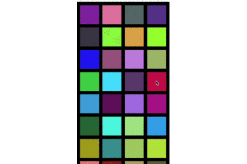
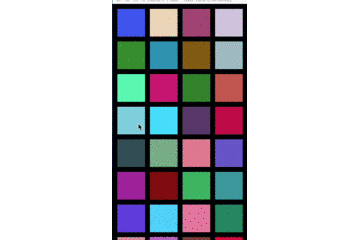

# FlexibleCollectionView

[](http://cocoapods.org/pods/FlexibleCollectionView)
[](https://img.shields.io/badge/LICENSE-MIT-yellow.svg)
[](https://img.shields.io/badge/Language-Swift3-blue.svg)


## Example




## Usage

Example of using in ViewController.

```swift
let layout = FlexibleCollectionViewLayout()

// The number of rows
layout.rows = 4

// The space between items
layout.spacing = 15

// Animation duration
layout.duration = 0.4

layout.sectionInset = UIEdgeInsets(top: 15, left: 15, bottom: 15, right: 15)

collectionView = FlexibleCollectionView(frame: UIScreen.main.bounds, layout: layout)

collectionView.delegate = self

collectionView.dataSource = self

collectionView.register(UICollectionViewCell.self, forCellWithReuseIdentifier: "CELL")

view.addSubview(collectionView)

```

FlexibleCollectionViewLayout is inherited from UICollectionViewFlowLayout.
and these properties are available.

|Property name|Description|
|--------|-------|
|rows|The number of row|
|maximumRows|The maximum row count|
|minimumRows|The minimum row count|
|spacing|The space between items|
|duration|Animation duration|
|animationEnabled|animation flag|

FlexibleCollectionView can use the following `delegate`.
```swift
@objc public protocol FlexibleCollectionViewDelegate: UICollectionViewDelegate {

    @objc optional func flexibleCollectionView(_ collectionView: FlexibleCollectionView, willSwipeViewFor direction: UISwipeGestureRecognizerDirection)

    @objc optional func flexibleCollectionView(_ collectionView: FlexibleCollectionView, didSwipeViewFor direction: UISwipeGestureRecognizerDirection)

    @objc optional func flexibleCollectionView(_ collectionView: FlexibleCollectionView, didFinishAnimation: Bool)

}

```
## Requirements

XCode8+

Swift3

## Installation

```ruby
pod "FlexibleCollectionView"
```

and

`$ pod install`

## Author

Ryo Ishikawa, rinov@rinov.jp

## License

FlexibleCollectionView is available under the MIT license. See the LICENSE file for more info.
